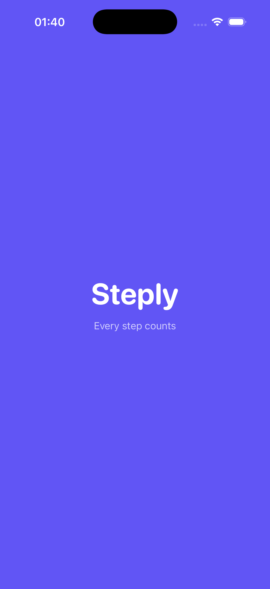
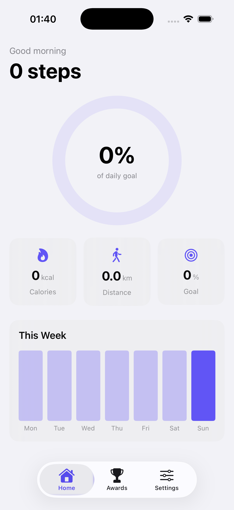
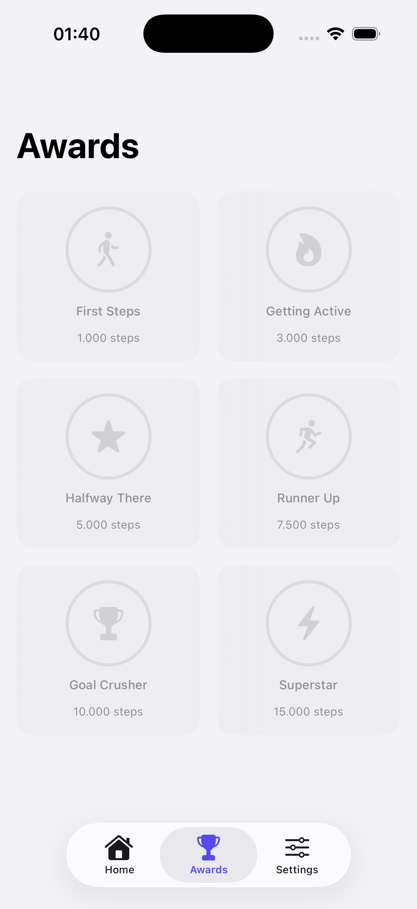
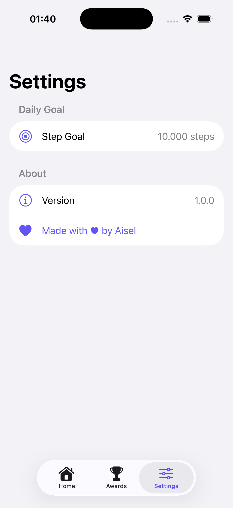

# Steply

Step tracker app for iOS. Built to practice HealthKit and MVVM in SwiftUI.

## Screenshots

| Home | Awards | Settings | Splash |
|------|--------|----------|--------|
|  |  |  |  |

## Features

- Daily steps, calories, distance
- Progress ring
- Weekly bar chart
- Awards that unlock by step count
- Editable daily goal
- Dark mode

## Tech

SwiftUI, HealthKit, async/await, MVVM, @Observable, SF Symbols
